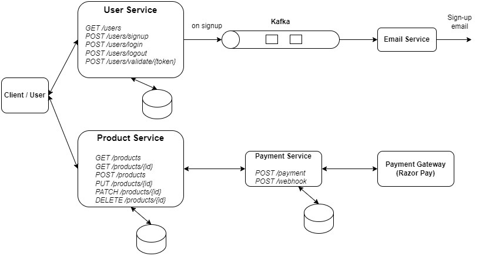

[E-Commerce System Design]

Products & Category API endpoints:

1. Get products and categories:
	GET /products
	GET	/products/1
	GET /categories
	GET	/categories/1

2. Add new product:
	POST /products
	
	body:
	{
		"title": "Mountanins t-shirt",
		"description": "ZARA T-shirt",
		"price": 2500,
		"imageUrl": "https://someimagerepo.com/img/Mountaninst-shirt.jpg",
		"category": {
			"name": "T-Shirts"
		}
	}
	
3. Delete a product:
	DELETE /products/1

4. Replace a product:
	PUT /products/1
	
	body:
	{
		"title": "Mountanins t-shirt",
		"description": "ZARA T-shirt",
		"price": 2500,
		"imageUrl": "https://someimagerepo.com/img/Mountaninst-shirt.jpg",
		"category": {
			"name": "T-Shirts"
		}
	}
	
5. Update a product:
	PATCH /products/1
	
	body:
	{
		"description": "ZARA T-shirt Limited Edition",
		"price": 9999,
	}